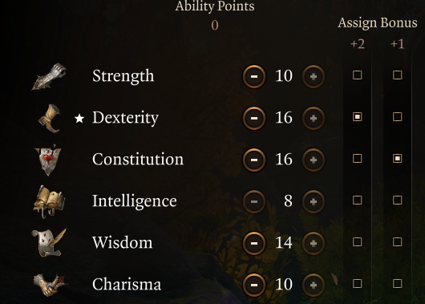

### Character creation

- Drow
- Ranger  
  
- Favoured Enemy: Bounty Hunter (class feature): Gain Investigation Proficiency. Creatures hit with Ensnaring Strike have Disadvantage on Saves.
- Natural Explore: Wasteland Wanderer: Fire
- Find Familiar (class spell): Summon a familiar, fey spirit that takes an animal form of your choosing.

### Level 2

- Archery fighting style
- Hunter's mark
- Ensnaring strike

### Level 3

- Subclass: Gloom Stalker
- Hail of thorns

### Level 4

- Feat: Sharpshooter

### Level 5

- Spike growth
- Pass without trace (replace a spell for this one, or let shadowheart have it and pick an offensive)
- Misty step

### Level 6

- Rogue multiclass

### Level 7

- Rogue level 2

### Level 8

- Rogue level 3

### Level 9

- Rogue level 4
- Feat: Ability improvement: Dex (+2)

### Level 10

- Multiclass: Fighter
- Fighting style: Defensive

### Level 11

- Fighter level 2

### Level 12

- Fighter subclass: Battle master
- Manouvers:
    - Disarming attack
    - Trip attack
    - Pushing attack

## Gear

### Early

- **Head:** Shadow of Menzoberranzan:
    - Found in a secret area in the Myconid Colony, which is unlocked after completing a quest
- **Cape:** Durge cape
- **Chest:** Adamantine Scale Mail
- **Gloves:** Gloves of Archery
    -  Grat, Goblin Trader in Goblin Camp Ruins, Act 1
- **Boots:** Disintegrating Night Walkers
    - Dropped by True Soul Nere at Grymforge, Act 1
- **Necklace:** Moondrop Pendant
    - Found in magically sealed chest inside the Owlbear Nest, Act 1
- **Ring:** Crusher’s Ring
    - Crusher, the goblin next to the Goblin Camp waypoint (X:-74; Y: 437), Act 1.
- **Ring:** Caustic Band
    - Sold by Derryth Bonecloak at Myconid Colony, Underdark, Act 1.
- **Weapon 1:** Titanstring Bow
    - From Vendor Brem in the Zhentarim Hideout after completing Find the Missing Shipment, Act 1
- **Weapon 2 Main Hand:** Steelforged Sword
    - Opposite the blighted village waypoint is a building with a basement, unlock and enter the building through the big double set of doors and head down into the basement that has a big forge in it. In this room is a ladder leading up to a small wooden platform and a locked chest, the steelforged sword is locked in this chest.
- **Weapon 2 Off-Hand:** Hunter’s Dagger
    - Purchased from Roah Moonglow in the Shattered Sanctum.

### Late

- **Head:** Helm of Balduran
    -  After completing the Wrymway Trials and defeating a boss, Act 3
- **Cape:** Shade-Slayer Cloak
    -  purchased from Sticky Dondo in the Guildhall under the Lower City
- **Chest:** Armour of Agility
    - Sold by Gloomy Fentonson at Stormshore Armoury, Act 3
- **Gloves:** Gloves of Soul Catching
    - Reward for Save Hope quest
- **Boots:** Helldusk Boots
    -  Chest in Gortash Chambers, in Wyrm’s Rock Fortress (X: -34 Y: 220), Act 3
- **Necklace:** Surgeon’s Subjugation Amulet
    - Dropped by Malus Thorm at the House of Healing (X: -195 Y: 49), Act 2
- **Ring:** Killer’s Sweatheart
    - Self-Same Trial in Gauntlet of Shar, Act 2
- **Ring:** Shifting Corpus Ring
    - Dropped by Flaming Fist Marcus at the Last Light Inn, Act 2.
- **Weapon 1 Primary:** Gontr Mael
    -  Looted from Steel Watch Foundry Boss, Baldur’s Gate City (X: -291 Y: -163), Act 3
- **Weapon 2 Main Hand:** Bloodthirst
    - Reward for defeating Orin and completing Get Orin’s Netherstone, Act 3.
- **Weapon 2 Off-Hand:** Rhapsody
    -  Dropped by Cazador Szarr.